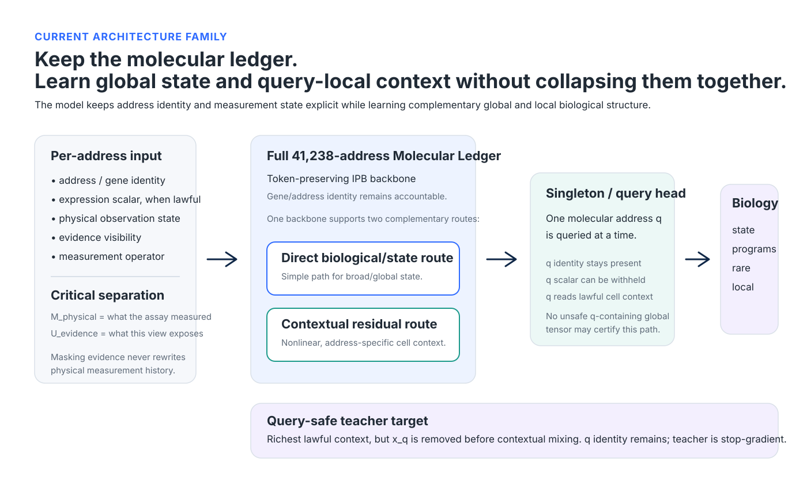
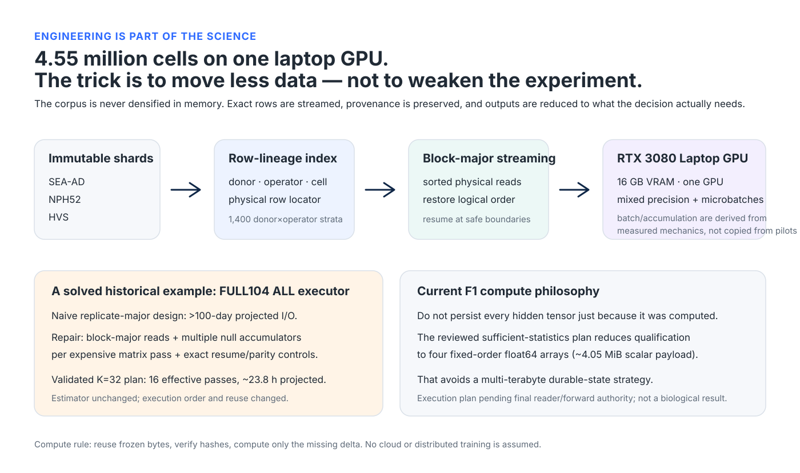

# Contextual JEPA — learning biological state from partial RNA

> **What can a cell tell us about itself when much of its molecular state is hidden from view?**

That is the question behind this project.

I am not trying to build another system whose main job is to fill in a missing expression matrix. The biological problem that interests me is harder: **can a model recover the programs that define a cell's state when it only sees part of the RNA evidence, when different assays measure different things, and when the easiest shortcuts have been deliberately removed?**

The current project is a pathology-blind, donor-aware JEPA framework built around a **41,238-address Molecular Ledger**. It keeps gene/address identity, physical measurement state and evidence visibility explicit. The representation is judged on whether partial RNA contains enough information to recover meaningful biological structure — broad state, weak distributed programs, local programs, core/halo structure, sparse marker-like programs and rare or unusual biology.

For the exact live execution gate, see [`START_HERE.md`](START_HERE.md). The older v1-v3 work is preserved for provenance, but it is not the current scientific story.

## Why deliberately show the model only part of the biology?

This is not masking for the sake of making training difficult.

In a real experiment we almost never observe a complete molecular state. Single-cell and single-nucleus datasets differ in depth, chemistry, coverage and gene support. A targeted assay may measure a different subset from a whole-transcriptome assay. Even within one platform, a zero can mean something very different from a feature that the assay could never measure.

If I always give the model the fullest possible profile, it can learn a brittle solution that depends on information that may not exist in another dataset. Worse, if the scalar value of the gene being queried is allowed into the model's contextual pathway, the model can solve the task by reading the answer rather than understanding the cell.

So partial evidence is deliberate. It creates a controlled biological stress test.

The current evidence ladder is **20%, 40%, 60%, 80% and 100%**, with **60%** as the primary operating point. A useful representation should become better as more lawful evidence is revealed. If it only works at 100%, I do not consider that a convincing solution to the problem we actually face.

There is another reason this matters. Ultimately I want representations that can travel across datasets and measurement regimes. A model that has learned the *state* should be able to recognize that state from different partial views. A model that has memorized one assay's expression vector will not.

## Why this problem is unusually hard

There are several problems stacked on top of one another.

**Missingness is not one thing.** The project distinguishes `MEASURED_SCALAR`, `STRUCTURALLY_UNMEASURED` and `MEASURED_COLLISION_UNRESOLVED`. A measured zero remains evidence. Artificial evidence masking changes what a particular model view is allowed to see; it does not rewrite what the assay physically measured.

**Gene identity must survive.** A single pooled cell embedding is useful, but it is not enough for this project. I want to know what the model thinks about a particular molecular address and how that address relates to the rest of the cell.

**The model can cheat.** For a query address `q`, the identity of `q` must remain present while its scalar value is removed *before* contextual mixing. Masking the final token after the value has already contaminated neighboring tokens or a global cell representation would be an invalid shortcut.

**Biology is distributed at several scales.** Common programs are easy to preserve. Weak, local, core/halo, sparse and rare programs are much easier to average away. We therefore protect them explicitly rather than letting performance on abundant biology dominate the conclusion.

**Millions of cells do not mean millions of independent biological replicates.** The donor is the primary inference unit. Cell-level pseudoreplication would make almost any tiny effect look convincing, so the qualification logic aggregates to donors and uses donor-aware uncertainty.

**Optimization can lie.** One of the most useful lessons from the earlier T1 trajectory was that the mathematical training loss could improve while the fine query-local biological geometry became worse. That changed the project. A lower loss is no longer allowed to certify biological progress by itself.

## The architecture we are building

The current architecture keeps a **full 41,238-address Molecular Ledger** rather than reducing the entire cell to one anonymous vector at the input.

At a high level, the online/student side has:

- a full-capacity token-preserving **IPB backbone**;
- a **direct biological/state route** for broad or simpler state structure;
- a **nonlinear contextual residual route** for address-specific cell context;
- a **singleton/query-local head** that asks about one molecular address at a time.

I want both the global and local descriptions because they answer different biological questions. A cell can have a coherent global state while the local relationship around a particular gene or program changes. Earlier work showed that those two axes can move differently during training.

The teacher sees the richest lawful context available for the cell, but the query-local target is **self-masked**: the identity of `q` remains, while the scalar `x_q` is excluded before tokenization/contextual mixing in the target path. The student sees a partial lawful view and must recover the teacher's contextual target.

Conceptually, the target is:

`query state - lawful context baseline`

followed by normalization.

That subtraction is important. The aim is to reduce domination by a generic cell-wide direction while retaining the address-specific biological context around the query.

The old `BlockPredictor` is retained only as a diagnostic/control. It is not the production architecture.

## What is different from large single-cell foundation models?

There is excellent work in this field already. Models such as **Geneformer**, **scGPT** and **scFoundation** have shown what can be learned by pretraining transformers on tens of millions of cells. Their success is an important reason to take representation learning in transcriptomics seriously.

This project is not trying to win by having the largest parameter count or the largest pretraining corpus. It is asking a complementary question.

Several widely used single-cell foundation models use masked-language, masked-value, denoising or generative expression objectives. Those objectives are useful, but our current target is deliberately different: **recover a latent, query-specific biological state from partial evidence without making exact hidden-expression reconstruction the scientific endpoint.**

The combination I care about here is:

| Design choice | Contextual JEPA |
|---|---|
| What is predicted? | Biological state/program structure, not the exact hidden count |
| Molecular accountability | Full address-resolved Molecular Ledger |
| Missingness | Explicit physical observation states, not one generic mask |
| Query leakage | Query identity retained; query scalar excluded before contextual mixing |
| Representation | Global state **and** query-local context are separate axes |
| Evaluation unit | Donor, not individual cells |
| Negative control | Matched wrong-cell/value-support nulls that preserve hard nuisance structure |
| Biology protection | Broad, weak, local, core/halo, sparse and innovation/rare programs |
| Compute philosophy | Streaming, reuse and sufficient statistics on one laptop GPU |
| Governance | Prospective contracts and independent adjudication before promotion |

I would not claim that every individual ingredient is unique by itself. What is unusual is putting all of them together and refusing to relax the biological or statistical contract simply because the computation is inconvenient.

## The data scale

The current lawful reader-fit population contains:

- **4,553,407 cells**
- **104 donors**
- **42 measurement operators**
- **1,400 donor × operator strata**
- **41,238 molecular addresses**

Source composition:

- **SEA-AD:** 4,118,213 cells
- **NPH52:** 236,476 cells
- **HVS:** 198,718 cells

Protected reader-validation, reader-oracle, DEV, SEALED and pathology expression remain outside this reader-fit scope.

The 42 operators matter. They are not simply batches to be ignored. They have different physical measurement support over the common molecular namespace. The model therefore has to separate biological evidence from what a particular measurement process made observable.

This is also why dataset-dependent quantities are not copied from a 50,000-cell pilot or a convenient small cohort. If a quantity depends on donor composition, abundance, measurement support, context length or geometry, it has to be earned on the real lawful corpus.

## Doing this on one laptop GPU

The hardware constraint is real: the project is developed around **one NVIDIA RTX 3080 Laptop GPU with 16 GB of VRAM**, not a cloud cluster.

That forces a useful discipline. The solution cannot be “load everything into memory” or “run another hundred-model sweep.”

The full 4.55-million-cell corpus is represented through immutable source shards and an exact row-lineage index. Computation is streamed. Physical disk reads can be sorted for efficiency and then restored to the exact frozen logical order. Expensive passes are reused whenever the scientific semantics allow it. Resume boundaries, hashes and parity checks are part of the executor rather than afterthoughts.

A good example came from the historical FULL104 ALL calculation. The first replicate-major implementation was essentially an **I/O problem projected beyond 100 days** because the same large matrices were being reread for each null. We changed the execution order — not the estimator — to block-major streaming with multiple independent null accumulators per expensive pass. The validated K=32 production plan required 16 effective matrix passes and was projected at roughly **23.8 hours**.

That experience now informs the current F1 executor design.

For the upcoming F1 qualification, the current reviewed storage plan also avoids persisting every full hidden state. Once the scalar reduction is independently validated, the decision can be represented by four fixed-order float64 arrays with only about **4.05 MiB of final scalar payload**, rather than a multi-terabyte durable hidden-state archive. This is an execution design, not a biological result, and it remains contingent on the final reader/forward authority.

The general rule is simple:

> **Reuse frozen bytes. Verify hashes. Stream what is needed. Compute only the missing scientific delta.**

Compute efficiency is not separate from rigor here. It is how we make rigorous experiments possible on constrained hardware.

## A failure that changed how we judge the model

The project has had several technically successful experiments that were scientifically rejected.

The most important example is the historical T1 trajectory. Training drove its mathematical objective down, but the fine query-local biology that was already present at the authenticated starting point was progressively damaged. Coarse/global information survived much better.

That result is why the current design refuses to use a single aggregate loss as proof of success.

A future student trajectory must independently preserve or improve:

1. **global biological programs**, and
2. **query-local, correct-cell contextual biology**.

If one improves while the other collapses, the run does not pass.

I consider this a strength of the project. Failed mechanisms have been allowed to change the scientific design rather than being hidden behind a better-looking loss curve.

## What a convincing result has to survive

I do not want a pretty UMAP to be the conclusion.

The current F1 design asks whether the contextual representation:

- beats a carefully matched wrong-cell/value-support null;
- remains positive after donor-level aggregation;
- is estimable across all eight protected program families;
- does not show decision-grade contextual degradation relative to the direct safe control;
- improves as evidence increases from 20% to 100%;
- retains query/address identity;
- survives source-specific replication;
- survives nuisance adjustment;
- does not reverse under independent numerical reconstruction.

The F1 design contains **2,781 evaluation cells**, **44,496 cell-query assignments**, **43,108 unique `(cell, q)` pairs** and **222,480 assignment-by-evidence effect rows**.

The statistics are frozen before the real outcome is allowed to exist.

## Why the project is intentionally fail-closed

A recurring theme in this work is that a plausible result is not enough.

We have stopped the project for:

- provenance mismatches;
- dataset-scope mismatches;
- incorrect null geometry;
- invalid later-dimension re-entry;
- query-self leakage risk;
- numerical normal-equation fragility;
- and, most recently, a tiny floating-point defect in the evidence-trend calculation that can make a mathematically flat curve look weakly positive.

That last issue is exactly the kind of bug that would be easy to ignore because the number is tiny. We are fixing it **before** real F1, because the sign of that statistic is decision-bearing.

This is slower than simply running the model, but it gives each eventual result a much clearer interpretation.

## Where the project stands now

Established:

- FULL104 lawful reader-fit data and observation semantics are reconciled.
- The current Contextual Target V1 implementation passed F0.
- The F1 assignment, null and donor-level decision design is frozen.
- The HC3 nuisance integration has passed independent QR-versus-SVD numerical review.
- The public data/compute story is reproducible from preserved authorities.

Not yet claimed:

- **No real F1 biological result has been run.**
- **No current Contextual V1 training trajectory is authorized yet.**

The only live scientific repair is the prospectively frozen evidence-trend arithmetic correction. After that passes external review, the next step is the real reader/forward/executor preflight.

For audit-level status, use:

- [`START_HERE.md`](START_HERE.md)
- [`docs/agent/memory-os/ACTIVE_STATE.md`](docs/agent/memory-os/ACTIVE_STATE.md)
- [`docs/agent/CURRENT_AUTHORITY_INDEX.md`](docs/agent/CURRENT_AUTHORITY_INDEX.md)
- [`docs/agent/CURRENT_SUPERSESSION_MAP.md`](docs/agent/CURRENT_SUPERSESSION_MAP.md)
- [`docs/agent/EVIDENCE_INDEX.md`](docs/agent/EVIDENCE_INDEX.md)

Current figures are collected in [`docs/figure_gallery.md`](docs/figure_gallery.md).

## Related work

The project takes a complementary direction to several important single-cell foundation models:

- **Geneformer** — Theodoris et al., *Nature* (2023), [Transfer learning enables predictions in network biology](https://doi.org/10.1038/s41586-023-06139-9)
- **scGPT** — Cui et al., *Nature Methods* (2024), [scGPT: toward building a foundation model for single-cell multi-omics using generative AI](https://doi.org/10.1038/s41592-024-02201-0)
- **scFoundation** — Hao et al., *Nature Methods* (2024), [Large-scale foundation model on single-cell transcriptomics](https://doi.org/10.1038/s41592-024-02305-7)

The older Graph-JEPA v1-v3 work and its figures remain in this repository as scientific history. They document ideas that worked, ideas that failed, and why the present project looks very different from where it started.
