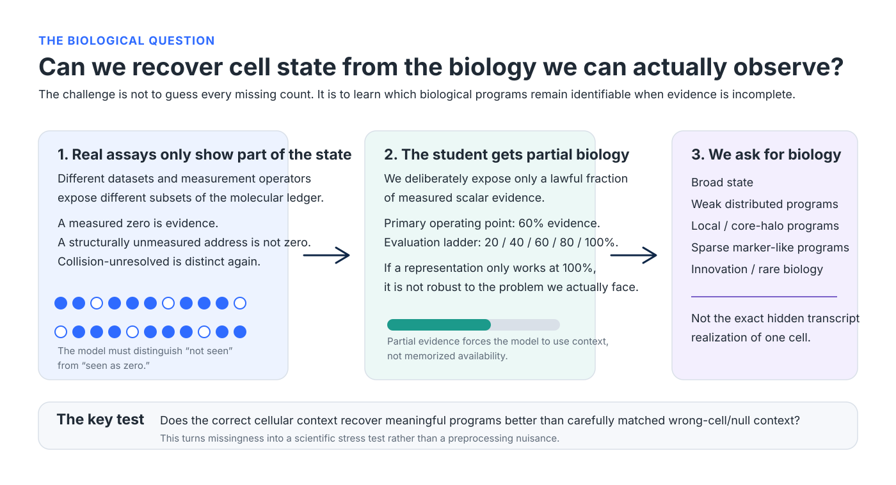
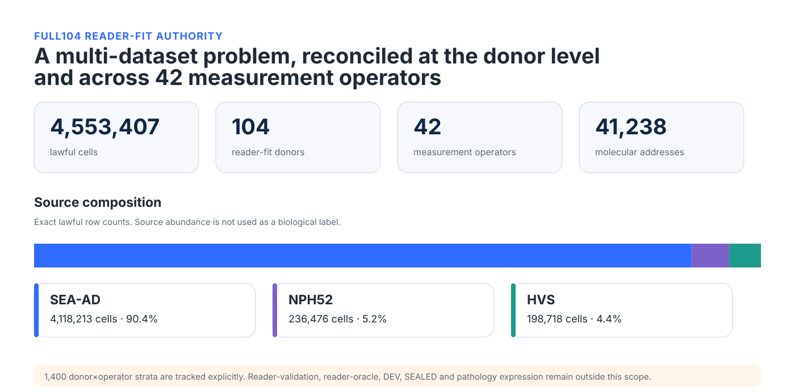

# JEPA for biological state from partial RNA

This project asks a fairly simple biological question:

> **If we only see part of a cell's RNA profile, can we still recover the biological programs that define its state?**

The goal is **not** to guess every hidden transcript. Single-cell and single-nucleus measurements are incomplete in several different ways, and a measured zero is not the same thing as a gene that was never measurable in that assay. I want the model to respect those distinctions and learn from the biological context that is actually present.

The current work uses a contextual JEPA design over a **41,238-address molecular ledger**. Gene identity is preserved, physical measurement state is preserved, and the model is evaluated on whether partial evidence is sufficient to recover biologically meaningful programs and cell state.

For the exact live execution status, start with [`START_HERE.md`](START_HERE.md). The older v1-v3 work is still preserved in this repository for provenance, but it is no longer the current scientific story.

## The idea

In the current design, the query gene keeps its identity but its scalar value can be withheld. The model then has to use the rest of the lawful cellular context. That makes the question closer to the biological problem we care about: **does the surrounding molecular state contain enough information to infer the program?**

The protected program set includes broad and distributed signals, local programs, core/halo structure, sparse marker-like signals, and an innovation tail. Rare biology is treated as something the representation should preserve rather than average away.

## The data scale

The frozen reader-fit corpus currently contains:

- **4,553,407 cells**
- **104 donors**
- **42 measurement operators**
- **41,238 molecular addresses**

The source composition is 4,118,213 SEA-AD cells, 236,476 NPH52 cells, and 198,718 HVS cells. Development and sealed expression remain outside this reader-fit scope.

This scale matters because quantities that depend on abundance, assay geometry, donor composition, or measurement structure are derived from the full lawful corpus. We do not carry over convenient values from small pilot cohorts.

## What has been established so far

A few pieces of the current framework are already settled.

**The data and measurement semantics are frozen.** The full reader-fit population has been reconciled, duplicate cell locators checked, and the distinction between measured expression, structural non-measurement, and unresolved measurement collisions is explicit.

**The contextual target definition passed its F0 review.** The teacher can use the richest lawful context except the queried scalar; the student sees partial evidence; query identity remains present. This is the representation we now intend to test rather than another round of architectural search.

**The F1 evaluation design is frozen.** It contains 2,781 evaluation cells from the 104 donors, 44,496 cell-query assignments, 43,108 unique `(cell, query)` pairs, and 222,480 assignment-by-evidence effect rows. The primary comparison is against a matched null rather than against an easy or unrelated negative control.

**The HC3 nuisance analysis has passed independent numerical review.** The production calculation now uses a QR-based route and the independent check uses SVD, avoiding the fragile normal-equation path that was present in the older implementation.

There is also an important boundary: **the real F1 biological outcome has not been run yet.** A narrow numerical defect in the historical evidence-trend arithmetic is being repaired prospectively before any real F1 result is allowed to exist. Training is also still blocked. I would rather leave the public page temporarily modest than publish a result that has not cleared its own statistical machinery.

## How I think about success

I do not want a model that only makes a good-looking embedding. A useful representation should survive several harder checks:

- biological signal should be better for the correct cell than for a matched wrong-cell context;
- the effect should be visible at the donor level, not through cell-level pseudoreplication;
- it should hold across the protected program families, including weak and rare programs;
- performance should improve as more lawful evidence becomes available;
- query identity should matter in the right way;
- source-specific and nuisance-adjusted checks should not reverse the conclusion.

The primary evidence ladder is 20%, 40%, 60%, 80%, and 100%, with 60% as the main operating point.

## Why this may be useful

Many transcriptomic models are trained to reconstruct missing values. That is useful for some tasks, but it is not necessarily the right objective if the real scientific question is cell state.

A neuron, glial cell, immune cell, or diseased cell is not defined by one transcript. Its state is distributed across interacting programs. If a representation can recover those programs from partial and heterogeneous measurements while respecting what was actually observed, it may give us a more useful bridge across datasets, assays, and biological conditions.

That is the long-term aim here.

## Current scientific boundary

The live gate is maintained in [`START_HERE.md`](START_HERE.md) and [`docs/agent/memory-os/ACTIVE_STATE.md`](docs/agent/memory-os/ACTIVE_STATE.md). At the time of this README refresh:

- the FULL104 reader-fit authority is accepted;
- Contextual Target V1 F0 is closed PASS;
- the HC3 numerical-robustness repair is externally accepted;
- the evidence-trend numerical repair is the only authorized scientific step;
- real F1 model-forward execution and training are not yet authorized.

For audit-level details, use:

- [`docs/agent/CURRENT_AUTHORITY_INDEX.md`](docs/agent/CURRENT_AUTHORITY_INDEX.md)
- [`docs/agent/CURRENT_SUPERSESSION_MAP.md`](docs/agent/CURRENT_SUPERSESSION_MAP.md)
- [`docs/agent/EVIDENCE_INDEX.md`](docs/agent/EVIDENCE_INDEX.md)

## Historical work

The repository contains several earlier generations of the project, including the original SEA-AD pathology-focused v1-v3 work and its figures. Those files are retained because they document how the project evolved and which ideas failed or were superseded.

They should **not** be read as the current result set. The current public figures are collected in [`docs/figure_gallery.md`](docs/figure_gallery.md).
