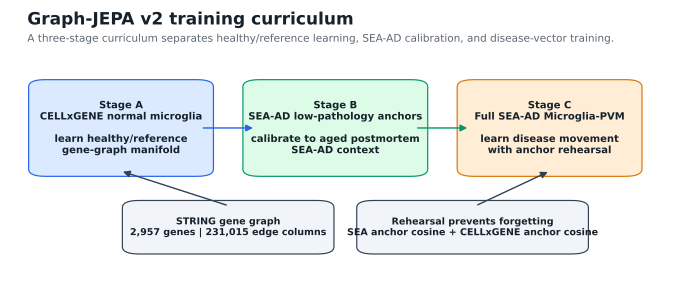
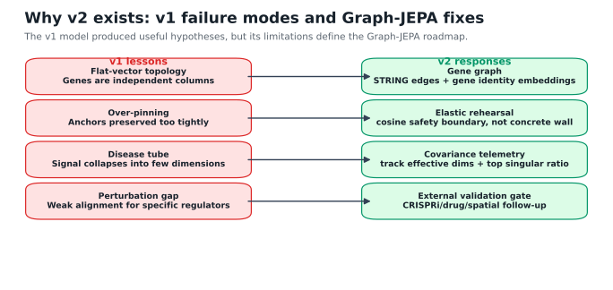
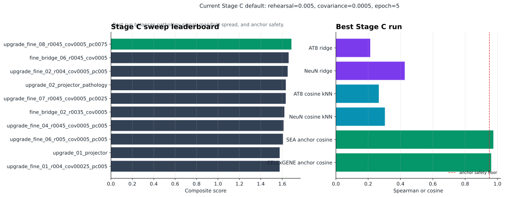
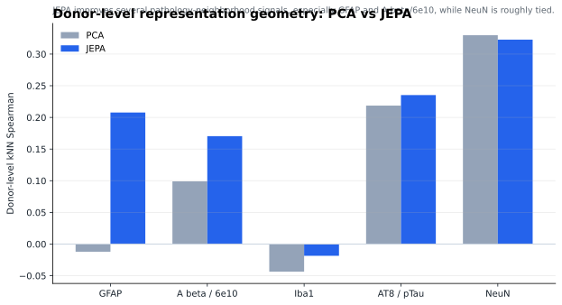
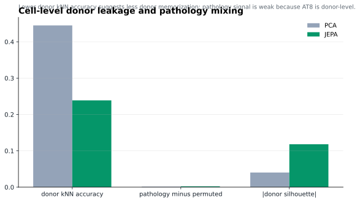
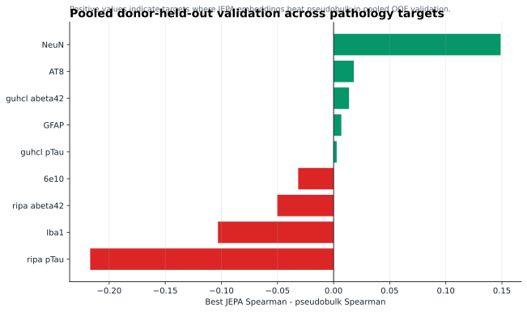
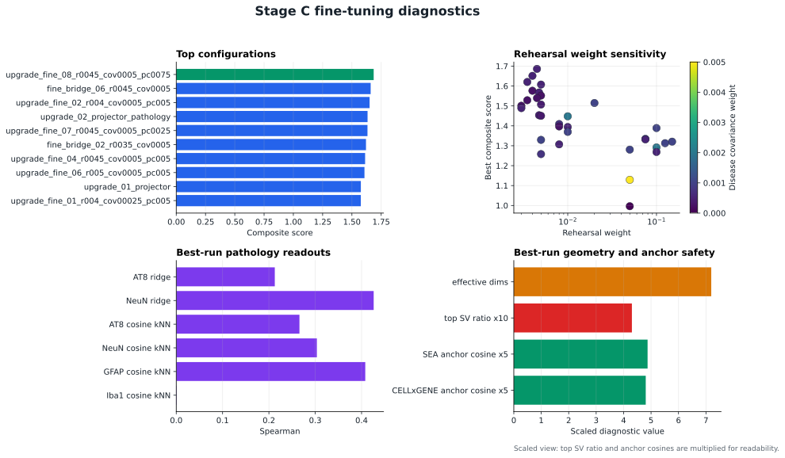

# Figure Gallery

This page collects the public-facing schematics and result graphs for the SEA-AD Graph-JEPA project. The main public figure set is generated by:

```powershell
python scripts/generate_public_figures.py
```

The Stage C fine-tuning diagnostic is generated by:

```powershell
python scripts/generate_stage_c_finetuning_report.py
```

The figures are intentionally lightweight and GitHub-friendly. They summarize the project narrative and key results without requiring local model checkpoints or raw H5AD files.

## 1. Graph-JEPA v2 Curriculum



**Figure legend:** Graph-JEPA v2 is organized as a staged training curriculum. Stage A learns a healthy/reference microglial manifold from normal-labeled CELLxGENE nuclei. Stage B calibrates that reference to low-pathology SEA-AD Microglia-PVM nuclei so the model can account for aged postmortem tissue and SEA-AD-specific processing. Stage C trains on the full SEA-AD Microglia-PVM cohort while rehearsing both healthy and low-pathology anchors, allowing disease-associated movement without fully forgetting the reference state.

**What it shows:** The v2 model is trained as a three-stage curriculum.

```text
Stage A: CELLxGENE normal microglia -> healthy/reference manifold
Stage B: SEA-AD low-pathology Microglia-PVM -> aged postmortem calibration
Stage C: full SEA-AD Microglia-PVM -> disease-vector learning with rehearsal
```

**Why it matters:** This design avoids training only on diseased postmortem brains. It also avoids catastrophic forgetting by using anchor rehearsal when learning disease movement.

## 2. Why v2 Exists



**Figure legend:** The v1 flat-vector JEPA produced useful pathology-linked representations, but the follow-up diagnostics exposed architectural limits: genes were treated as independent columns, healthy anchors could be over-pinned during disease fine-tuning, and disease signal could collapse into a narrow latent direction. Graph-JEPA v2 responds by adding gene-graph topology, learnable gene identity embeddings, elastic anchor rehearsal, and explicit manifold telemetry.

**What it shows:** The main limitations of v1 flat-vector JEPA and the corresponding v2 design responses.

**Key message:** v1 was useful for hypothesis generation, but it treated genes as independent columns. Graph-JEPA v2 adds gene topology, gene identity embeddings, elastic rehearsal, and explicit geometry telemetry.

## 3. Stage C Sweep Leaderboard



**Figure legend:** Stage C fine-tuning configurations are ranked by a composite score that balances pathology predictivity, manifold geometry, and anchor preservation. The current best run uses loose rehearsal plus a small disease covariance penalty, suggesting that the disease manifold needs room to expand while still staying tied to healthy/reference anchors.

**What it shows:** The top Stage C fine-tuning configurations ranked by the current composite score.

Best current setting:

```text
run: fine_loose_01_r005_cov0005
checkpoint: epoch 5
SEA/CELLxGENE rehearsal weight: 0.005
disease covariance weight: 0.0005
```

**Why it matters:** The best run is elastic, not tightly pinned. It keeps both reference anchors above the 0.95 cosine safety floor while allowing more disease-geometry movement than earlier Stage C runs.

## 4. Donor-Level PCA vs JEPA Pathology Geometry



**Figure legend:** Donor-level representations are compared by asking whether local neighborhoods predict pathology targets. PCA is a strong expression-only baseline, while JEPA tests whether self-supervised latent prediction produces neighborhoods that better reflect neuropathology. Improvements here support the claim that JEPA is learning pathology-relevant geometry rather than only producing visually appealing clusters.

**What it shows:** Donor-level kNN Spearman for PCA and JEPA representations across pathology targets.

**Key message:** JEPA improves several pathology-neighborhood signals, especially GFAP and A beta/6e10, while NeuN is roughly tied or slightly PCA-favored in this view.

## 5. Cell-Level Donor Leakage and Pathology Mixing



**Figure legend:** Cell-level diagnostics test whether the latent space is dominated by donor identity or by disease-relevant biology. Lower donor leakage suggests better mixing across patients, while pathology separation is interpreted cautiously because donor-level pathology labels are broadcast to many individual cells from the same donor.

**What it shows:** Cell-level donor leakage diagnostics comparing expression PCA and JEPA.

**Key message:** JEPA has lower donor kNN accuracy than PCA, suggesting it is less dominated by donor identity. Cell-level pathology separation is weak for both models because AT8 is a donor-level label broadcast to cells.

## 6. Multi-Target Donor-Held-Out Validation



**Figure legend:** Pooled out-of-fold validation compares the best JEPA representation against a pseudobulk ridge baseline across multiple neuropathology axes. Positive values indicate targets where JEPA outperforms pseudobulk under donor-held-out evaluation; negative values highlight targets where the simpler baseline remains stronger. This figure is meant to show both wins and current limits.

**What it shows:** Best JEPA minus pseudobulk Spearman across multiple pathology targets in pooled donor-held-out validation.

**Key message:** JEPA is strongest for NeuN and AT8 axes in this comparison, competitive for some biochemical amyloid/tau targets, and weaker than pseudobulk for others. This is useful because it shows where the representation is currently earning its complexity and where it is not.

## 7. Stage C Fine-Tuning Parameter Sensitivity



**Figure legend:** The fine-tuning diagnostics summarize the current active v2 baseline. The best run, `fine_loose_01_r005_cov0005`, uses low rehearsal weight and a very small disease covariance penalty. It preserves SEA-AD and CELLxGENE anchors just above the 0.95 cosine safety boundary while improving disease movement relative to over-pinned Stage C runs.

**What it shows:** Top Stage C configurations, rehearsal-weight sensitivity, pathology readouts for the best checkpoint, and scaled geometry/anchor-safety diagnostics.

**Key message:** The current useful regime is elastic. Tighter rehearsal preserves anchors but can compress disease geometry; heavier covariance can reduce the disease tube but over-damp pathology movement. The next experiments should narrow the sweep around rehearsal `0.003-0.008` and covariance `0.00025-0.00075`.

## Interpretation Boundary

These figures support the current project thesis:

```text
Graph-JEPA learns a pathology-grounded microglial state space
and supports counterfactual gene-network hypothesis generation.
```

They do **not** prove biological causality. Digital knockouts and latent counterfactuals remain model-implied hypotheses until tested with external perturbation, spatial, imaging, or wet-lab evidence.
